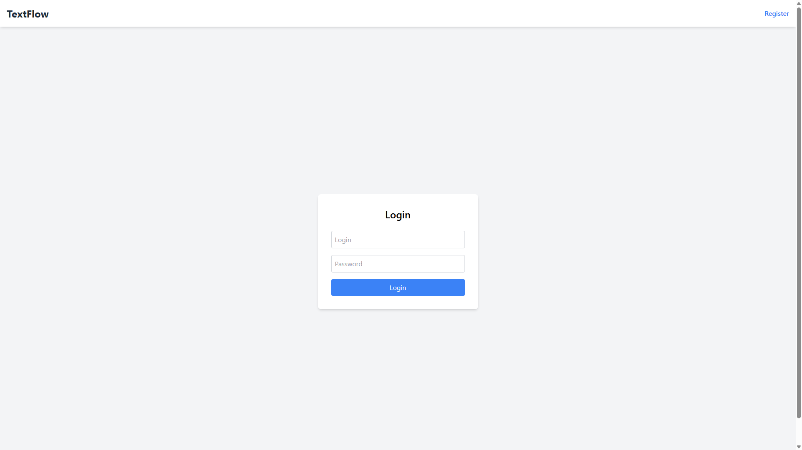
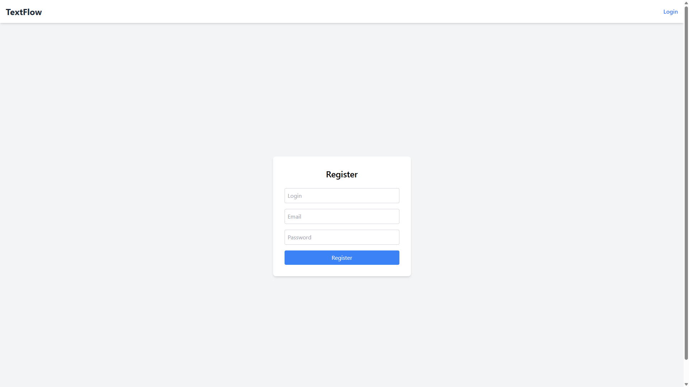
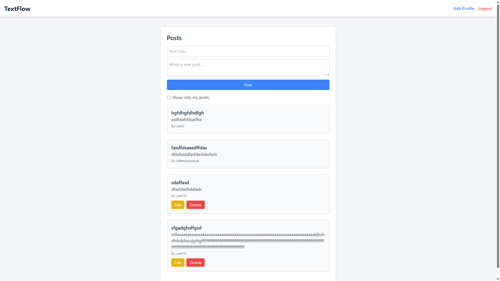
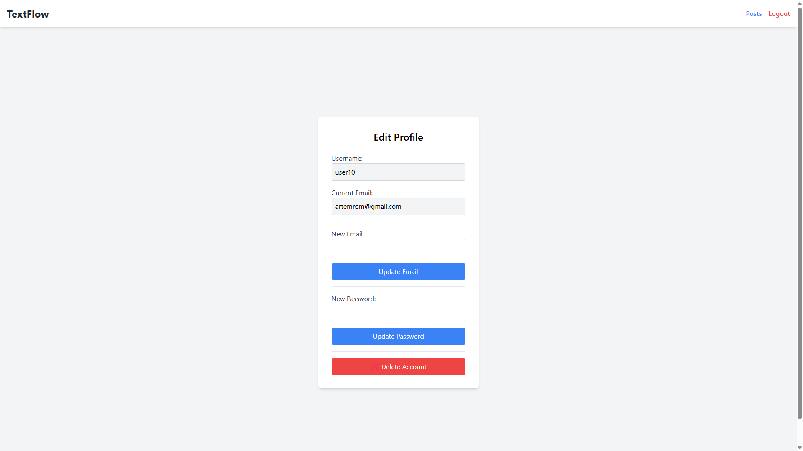

# TextFlow

TextFlow is a platform designed for creating, editing, and managing text-based posts. Users can easily write, edit, and delete their posts.

---

## Features
### User Authentication
- Secure user registration and login using JWT authentication.
- Password hashing with BCrypt for enhanced security.
- Protected routes ensuring only authenticated users can access their data.

### Profile Management
- Update email address.
- Change password.
- Delete account permanently.

### Post Management
- Create new text-based posts.
- Edit or delete posts.
- View posts from all users.

---

## Prerequisites
- Java 21
- MySQL 8 or higher
- Maven
- Angular CLI
- Node.js

---

## Technologies Used
### Backend (Spring Boot)
- **Spring Boot**: Framework for backend development.
- **Spring Security**: Authentication and authorization.
- **JWT**: Secure tokens.
- **Spring Data JPA & Hibernate**: Database management.
- **MySQL**: Relational database.
- **BCrypt**: Secure password hashing.
- **Tomcat**: Embedded web server.
- **Maven**: Dependency management.

### Frontend (Angular)
- **Angular**: Modern frontend framework.
- **Tailwind CSS**: Styling.
- **TypeScript**: Strongly-typed JavaScript.

---

## Installation
### 1. Clone the repository
```bash
git clone https://github.com/jabka1/TextFlowSpringAngular.git
cd TextFlow
```

### 2. Backend Setup
#### Configure MySQL Database
Modify `application.properties`:
```properties
spring.datasource.url=jdbc:mysql://localhost:3306/textflow
spring.datasource.username=your_user
spring.datasource.password=your_password
spring.jpa.hibernate.ddl-auto=update
```
#### Build and Run Backend
```bash
mvn clean install
mvn spring-boot:run
```

### 3. Frontend Setup
#### Navigate to Frontend Directory
```bash
cd frontend/textflow
```
#### Install Dependencies
```bash
npm install
```
#### Run Angular App
```bash
ng serve
```

### 4. Access the Application
Open your browser and navigate to: `http://localhost:4200/`.

---

## API Endpoints

### Authentication
| Method  | Endpoint           | Description                |
|---------|-------------------|----------------------------|
| `POST`  | `/auth/register`  | Register a new user        |
| `POST`  | `/auth/login`     | Authenticate user          |

### User Account Management
| Method   | Endpoint                  | Description                  |
|----------|---------------------------|------------------------------|
| `GET`    | `/account`                | Get current user info        |
| `PUT`    | `/account/update-email`   | Update user email            |
| `PUT`    | `/account/update-password`| Update user password         |
| `DELETE` | `/account/delete`         | Delete user account          |

### Posts
| Method   | Endpoint                  | Description                  |
|----------|---------------------------|------------------------------|
| `GET`    | `/posts`                  | Get all posts                |
| `GET`    | `/posts/{id}`             | Get post by ID               |
| `POST`   | `/posts/create_post`      | Create a new post            |
| `PUT`    | `/posts/edit_post/{id}`   | Edit an existing post        |
| `DELETE` | `/posts/delete_post/{id}` | Delete a post                |

### Usage
- The API requires authentication for user-related and post-related operations.
- Use JWT tokens in the `Authorization` header for protected endpoints.

You can test the API at `http://localhost:8080/` using Postman or another platform

---

## Screenshots
### Login Page


### Register Page


### Post Feed


### Edit Profile


---
